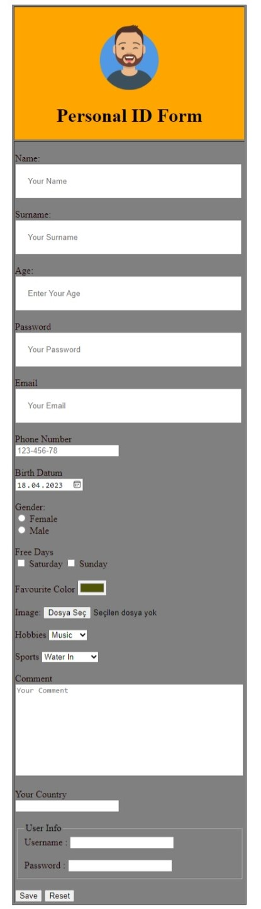

# Personal ID Form

<h3>visit: https://aokmen.github.io/Personal_ID_Form
/</h3>

#Description:
---
This code is an HTML form that allows users to input personal information. It includes fields for the user's name, surname, age, password, email, phone number, birth date, gender, free days, favorite color, image, hobbies, sports, comments, and country.
---
The form uses several types of input fields such as text, password, email, tel, date, radio buttons, checkboxes, color, file, select, and datalist.
---
Some of the input fields have additional attributes such as required, pattern, list, and value.
---
Finally, the form includes two buttons, one for submitting the form and one for resetting the form.
